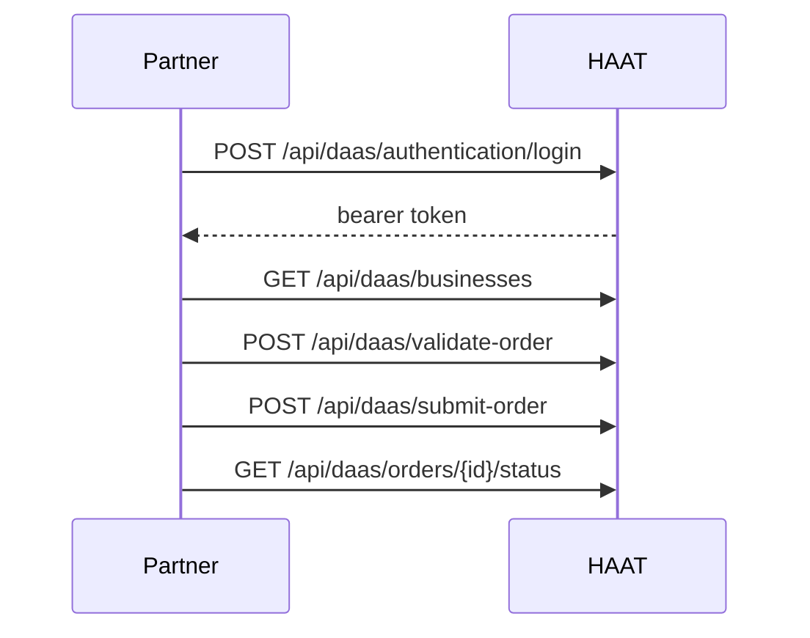

# DaaS overview

The DaaS External API lets partners authenticate, manage linked businesses, and validate/submit/cancel delivery orders on HAAT.

## Flow



## Authentication

<Steps>
  <Step title="Login">
    `POST /api/daas/authentication/login` with username/password from onboarding.
  </Step>
  <Step title="Use the bearer token">
    Send `Authorization: Bearer <token>` on all other DaaS calls.
  </Step>
</Steps>

## Endpoints

| Method | Path | Purpose |
| --- | --- | --- |
| `POST` | `/api/daas/authentication/login` | Get bearer token |
| `GET` | `/api/daas/businesses` | List linked businesses |
| `POST` | `/api/daas/validate-order` | Validate order before submit |
| `POST` | `/api/daas/submit-order` | Submit order to HAAT Delivery |
| `GET` | `/api/daas/orders/{haatOrderId}/status` | Order status |
| `PUT` | `/api/daas/orders/{haatOrderId}/cancel` | Cancel if not picked up/delivered |

## Order rules

<AccordionGroup>
  <Accordion title="Business ID mapping">
    If HAAT handles business ID mapping, leave `BusinessId` empty and send `posBusinessId`.
  </Accordion>
  <Accordion title="Cash orders">
    When `isCashOrder` is `true`, item `Price` values are required.
  </Accordion>
  <Accordion title="Cancel rules">
    Cancel is denied if the order was already picked up or delivered.
  </Accordion>
</AccordionGroup>

## Response envelope

```json
{
  "status": "success",
  "message": null,
  "data": {}
}
```

## Implementation checklist

<Check>Staging credentials received from HAAT</Check>
<Check>Login returns a usable token</Check>
<Check>Businesses list matches expected branches</Check>
<Check>Validate then submit order flow works</Check>
<Check>Cash orders include item prices</Check>
<Check>Status + cancel paths tested</Check>
