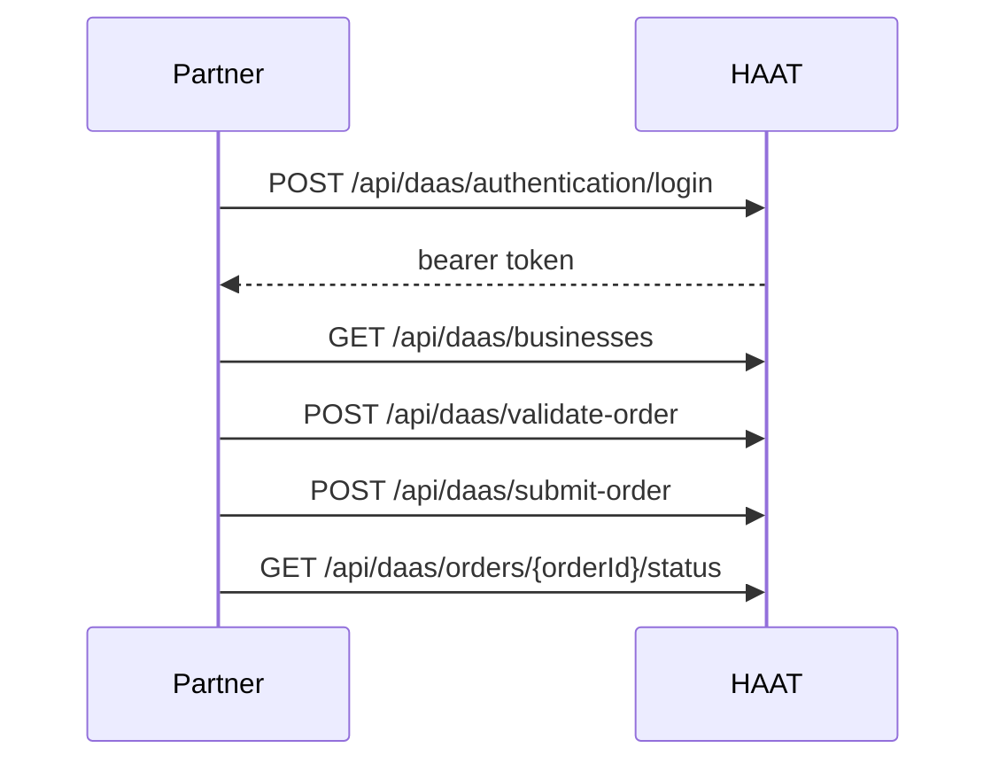

# DaaS overview

The DaaS External API lets partners authenticate, manage linked businesses, and validate/submit/cancel delivery orders on HAAT.

Base path: `/api/daas`

## Flow

## Endpoints

| Method | Path | Auth | Purpose |
| --- | --- | --- | --- |
| `POST` | `/api/daas/authentication/login` | none | Get bearer token |
| `POST` | `/api/daas/register/business` | admin JWT | Link Haat business to DaaS org |
| `POST` | `/api/daas/register/organization` | admin JWT | Create DaaS org credentials |
| `GET` | `/api/daas/businesses` | DaaS org JWT | List linked businesses |
| `PUT` | `/api/daas/{businessId}/update-business` | DaaS org JWT | Update business details |
| `POST` | `/api/daas/validate-order` | DaaS org JWT | Dry-run estimates (no order) |
| `POST` | `/api/daas/submit-order` | DaaS org JWT | Submit order to HAAT Delivery |
| `GET` | `/api/daas/orders/{orderId}/status` | DaaS org JWT | Order status |
| `PUT` | `/api/daas/orders/{orderId}/cancel` | DaaS org JWT | Cancel if not picked up/delivered |

Partner-facing field tables live in the [DaaS kit](/kits/daas/overview).

## Order rules

<AccordionGroup>
  <Accordion title="Business ID mapping">
    `businessId` is required unless `posBusinessId` is set (then `posBusinessId` overrides).
  </Accordion>
  <Accordion title="Cash orders">
    When `isCashOrder` is `true`, item `quantity` and `price` are required for cash pricing.
  </Accordion>
  <Accordion title="Cancel rules">
    Cancel is denied if the order was already picked up or delivered.
  </Accordion>
</AccordionGroup>
