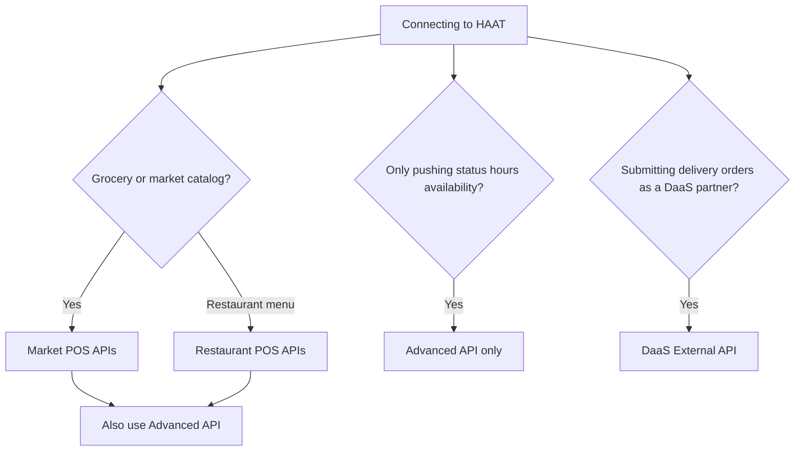

# Which integration do I need?

Use this guide to pick the correct API surface for your product.

## Decision guide

## Compare surfaces

<Tabs>
  <Tab title="Market POS">
    Choose this for **market / grocery** catalogs (barcodes, weighable units, quantity promotions).

    - Your POS hosts menu build, promotions, and order intake
    - HAAT calls your POS with `integrator-token` and `organization-token`
    - Your POS also calls HAAT to login and sync price/availability

    <Card title="Market POS overview" icon="store" href="/market-pos/overview" horizontal cta="Open docs" arrow="true">
      External APIs you host + HAAT sync APIs.
    </Card>
  </Tab>

  <Tab title="Restaurant POS">
    Choose this for **restaurants** with meals, addon groups, deals/combos, and real-time order create.

    - Your POS hosts `GET /api/menu` and `POST /api/orders`
    - HAAT calls your POS with Bearer token or HMAC (`X-Signature`)

    <Card title="Restaurant POS overview" icon="utensils" href="/restaurant-pos/overview" horizontal cta="Open docs" arrow="true">
      Menu sync and order create contracts.
    </Card>
  </Tab>

  <Tab title="Advanced API">
    Choose this when your POS needs to **call HAAT** to:

    - List assigned businesses
    - Update business / order status
    - Update working hours or item availability
    - Poll async request status

    Authenticate with `X-Api-Key`.

    <Card title="Advanced API" icon="plug" href="/advanced-api/overview" horizontal cta="Open docs" arrow="true">
      Business-scoped write APIs hosted by HAAT.
    </Card>
  </Tab>

  <Tab title="DaaS">
    Choose this when you are a **Delivery-as-a-Service partner** submitting delivery orders into HAAT.

    - Authenticate with username/password → bearer token
    - Validate, submit, status, and cancel flows

    <Card title="DaaS overview" icon="truck" href="/daas/overview" horizontal cta="Open docs" arrow="true">
      Partner delivery order APIs.
    </Card>
  </Tab>
</Tabs>

## Typical partner setup

<Info>
  Most restaurant and market partners implement:

  1. The outbound APIs HAAT calls on their POS (Market or Restaurant tab)
  2. The Advanced API for pushing operational updates back to HAAT

  DaaS partners use the DaaS tab instead of (or in addition to) POS hosting.
</Info>
