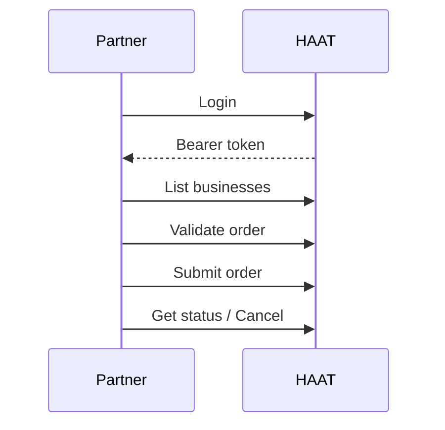

# DaaS overview

Use this kit for **Delivery-as-a-Service** partners who submit delivery orders into HAAT.

Base path: `/api/daas`

## Flow

## Endpoints at a glance

| # | Method | Path | Auth |
| --- | --- | --- | --- |
| 1 | `POST` | `/api/daas/authentication/login` | none |
| 2 | `POST` | `/api/daas/register/business` | admin JWT |
| 3 | `POST` | `/api/daas/register/organization` | admin JWT |
| 4 | `GET` | `/api/daas/businesses` | DaaS org JWT |
| 5 | `PUT` | `/api/daas/{businessId}/update-business` | DaaS org JWT |
| 6 | `POST` | `/api/daas/validate-order` | DaaS org JWT |
| 7 | `POST` | `/api/daas/submit-order` | DaaS org JWT |
| 8 | `GET` | `/api/daas/orders/{orderId}/status` | DaaS org JWT |
| 9 | `PUT` | `/api/daas/orders/{orderId}/cancel` | DaaS org JWT |

Every nested object is documented as its own table on the action pages.

## Pages in this kit

1. [Setup](/kits/daas/setup) — login, admin register, list businesses  
2. [Businesses](/kits/daas/businesses) — update business details  
3. [Orders](/kits/daas/orders) — validate, submit, status, cancel  
4. [Checklist](/kits/daas/checklist) — go-live
