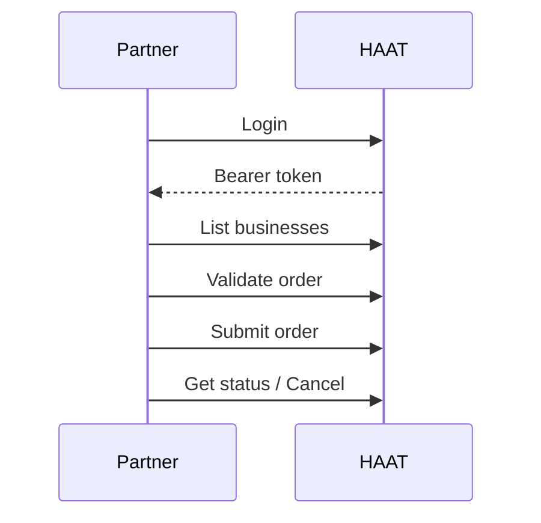

# DaaS overview

Use this kit for **Delivery-as-a-Service** partners who submit delivery orders into HAAT.

## Flow

## Pages in this kit

1. [Setup](/kits/daas/setup)  
2. [Orders](/kits/daas/orders)  
3. [Checklist](/kits/daas/checklist)
