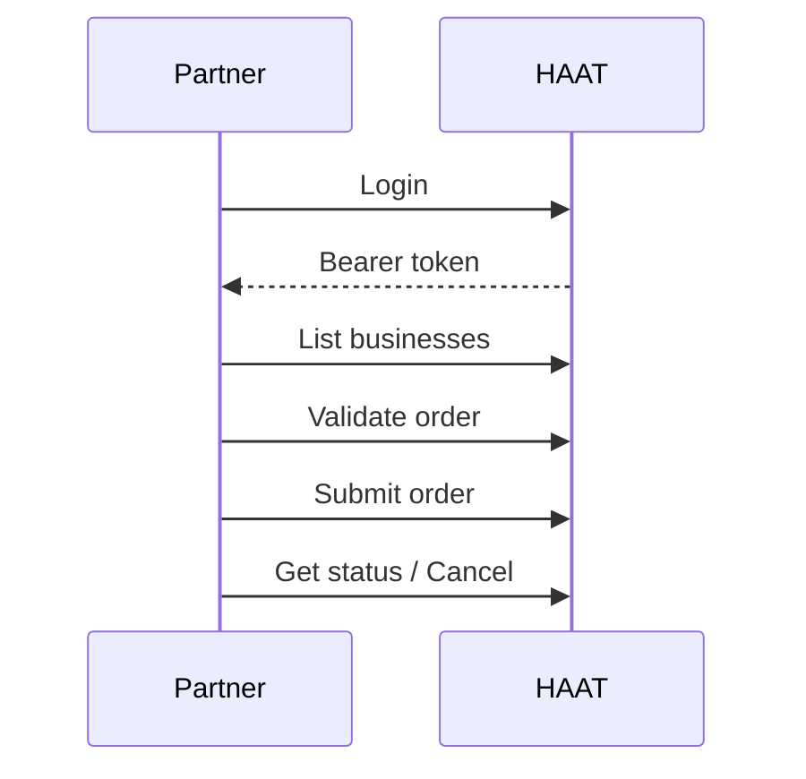

# DaaS overview

Use this kit for **Delivery-as-a-Service** partners who submit delivery orders into HAAT.

Each endpoint page in the sidebar shows **headers, body fields, and example responses** on the right.

Base path: `/api/daas`

## Flow

## How to read an endpoint

1. Open the page in the left menu (for example **Login**).
2. Read the required fields in the middle.
3. Use the sample request and `200` / error responses on the right.

## Start here

1. [Setup](/kits/daas/setup) — base URL and credentials
2. **Authentication** — `POST /api/daas/authentication/login`
3. **Businesses** — list and update
4. **Orders** — validate, submit, status, cancel
5. [Checklist](/kits/daas/checklist) — go-live
